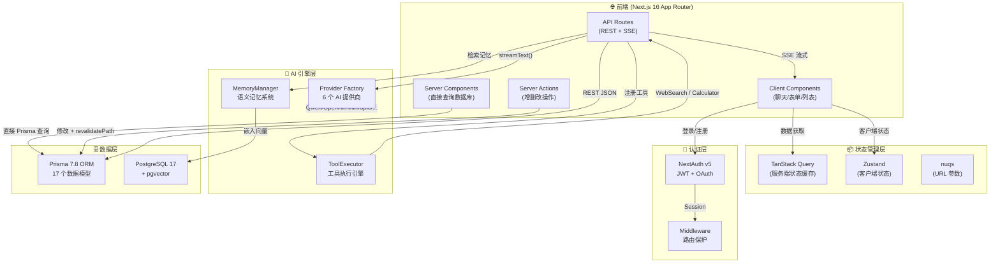
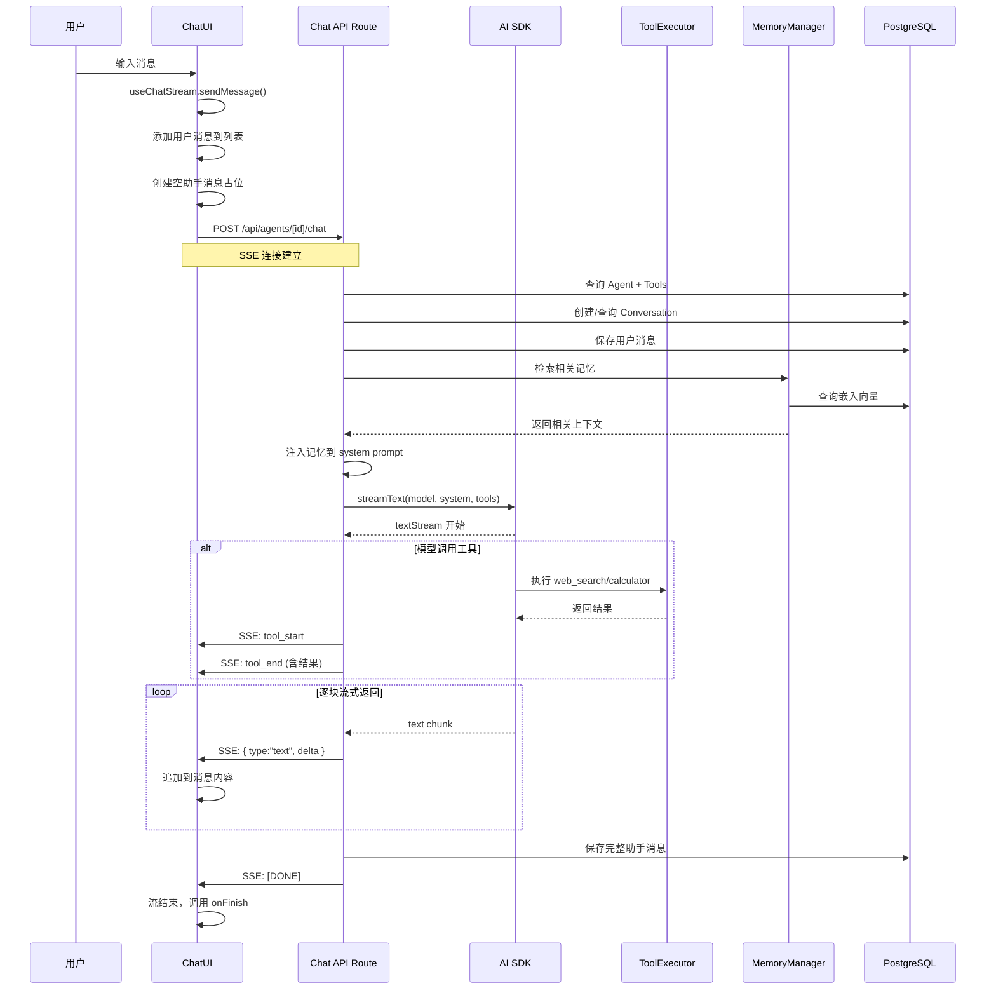
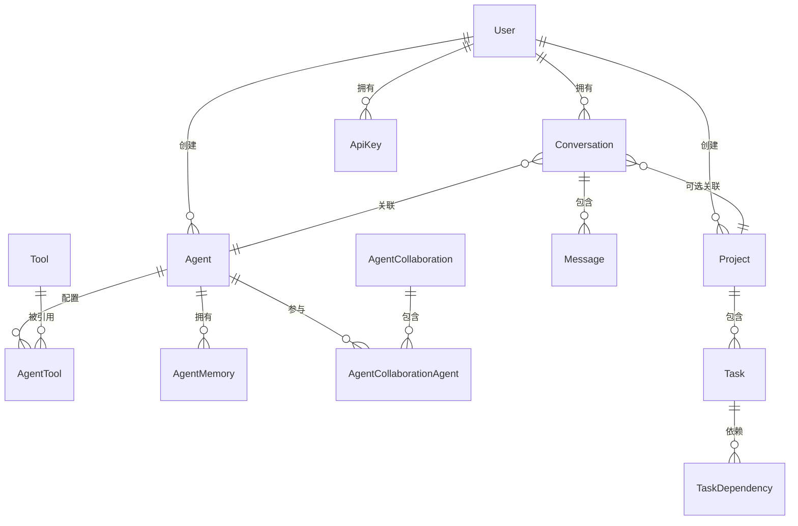

# AgentForge Architecture

## 🎯 整体架构图（数据流视角）



## 🔄 聊天流程（核心链路）



## 📁 目录结构（按功能划分）

```mermaid
graph LR
    subgraph pages["📄 页面"]
        Login["/login<br/>登录"]
        Register["/register<br/>注册"]
        Agents["/agents<br/>代理列表"]
        AgentNew["/agents/new<br/>创建代理"]
        AgentChat["/agents/[id]/chat<br/>聊天"]
        AgentMemory["/agents/[id]/memory<br/>记忆"]
        Convos["/conversations<br/>对话历史"]
        Settings["/settings<br/>设置"]
    end

    subgraph components["🧩 组件"]
        ChatW["ChatWindow<br/>聊天窗口"]
        ChatM["ChatMessages<br/>消息列表"]
        ChatMsg["ChatMessage<br/>单条消息"]
        ChatI["ChatInput<br/>输入框"]
        ToolC["ToolCallCard<br/>工具调用卡片"]
        CmdK["CommandMenu<br/>⌘K 搜索"]
        Side["AppSidebar<br/>侧边栏"]
        Header["Header<br/>頂部栏"]
    end

    subgraph hooks["🪝 Hooks"]
        H1["useChatStream<br/>SSE 流式聊天"]
        H2["useAgents<br/>代理 CRUD"]
        H3["useConversations<br/>对话 CRUD"]
        H4["useAgentMemory<br/>记忆 CRUD"]
    end

    subgraph lib["🔧 核心逻辑"]
        L1["auth.ts<br/>NextAuth 配置"]
        L2["prisma.ts<br/>数据库客户端"]
        L3["provider-factory.ts<br/>AI 模型工厂"]
        L4["ToolExecutor<br/>工具执行器"]
        L5["MemoryManager<br/>记忆管理器"]
        L6["embedding.ts<br/>文本嵌入"]
        L7["similarity.ts<br/>相似度计算"]
    end

    pages --> components
    components --> hooks
    hooks --> lib
```



## 🏗️ 17 个数据模型关系



## 💡 关键设计决策

### 为什么用 SSE 而不是 WebSocket？
聊天是单向流（服务端→客户端），SSE 原生支持、浏览器自动重连、与 HTTP 兼容。不需要 WebSocket 的双向开销。

### 为什么用 ref 解决陈旧闭包？
`useChatStream` 的 `sendMessage` 在 `useCallback` 中捕获 `messages`。如果用 `messages` 做依赖，每次流式更新都会重建函数。用 `useRef` 保持最新引用，避免这个问题。

### 工具执行为什么在路由层包装 SSE？
Vercel AI SDK 的 `streamText` 执行工具时，前端看不到中间状态。通过在 `execute` 函数里手动写 `writer.write()` 发送 `tool_start/tool_end` 事件，前端能实时看到工具执行进度。

### Provider Factory 怎么工作？
```typescript
getModel("qwen:qwen3.7-max")
// → createOpenAI({ baseURL: "https://dashscope.aliyuncs.com/compatible-mode/v1" })

getModel("openai:gpt-4o")
// → createOpenAI({ apiKey: process.env.OPENAI_API_KEY })

getModel("anthropic:claude-sonnet-4-6")
// → createAnthropic()
```
统一的 `provider:model-id` 字符串，路由层不需要知道具体用哪个厂商。

---

> 这张图对应项目路径 `D:\Desktop\ReactByVibeCoding\agent-forge\`
